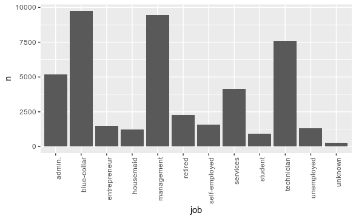
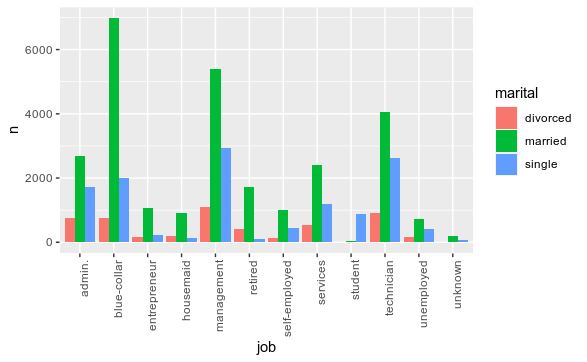

Normalmente modelos de machine learning tem dificuldade de trabalhar com dados em formato texto, com tećnicas de feature engineering buscamos alternativas de representar a informação da variável categórica de forma númerica, sem perder o teor ou informação, esta tem que ser a mesma.

Ao realizar Features Engineering é uma oportunidade de olhar para os dados de forma diferente, é importante separar o conceito de *data wrangling* (remover missing *NAs*, alterar variáveis, limpeza de dados) do conceito de *feature engineering* que é relacionado a alteração das variáveis para melhorar a forma de apresentação ou usabilidade.

**Fonte de Dados**
[UCI Back Marketing Data set](https://archive.ics.uci.edu/ml/machine-learning-databases/00222/bank.zip)

[UCI Info](https://archive.ics.uci.edu/ml/datasets/bank+marketing)


### Bibliotecas

```
#install.packages("dplyr")
#install.packages("ggplot2")
#install.packages(caret)

library(dplyr)
library(ggplot2)
library(caret)

```


### Download Dataset

```
tempdl <- tempfile()

baseURL <- 'https://archive.ics.uci.edu/ml/machine-learning-databases/00222/bank.zip'

download.file(baseURL, tempdl, mode = 'wb' )

```


### Lendo o Dataset
 - Utilizando read.table
 
```

unzip(tempdl, 'bank-full.csv')

dataset_bank <- read.table('bank-full.csv', header = TRUE, sep=';')
head(dataset_bank)
```

### Adicionando uma coluna

Baseado na coluna *job* criar uma coluna relacionado o nível de conhecimento em tecnologia


```
table(dataset_bank$job)

```

```
dataset_bank %>%
  group_by(job)%>%
  summarise(n = n())%>%
  ggplot(aes(x = job, y=n)) + 
  geom_bar(stat = 'identity')+
  theme(axis.text.x = element_text(angle = 90, hjust = 1))
```



Utilizando **Mutate** do dplyr é possível atribuir uma coluna ao dataset com base no conhecimento de cada job

Como isso acrescentamos uma informação ao conjunto de dados que pode ser importante analise

```

dataset_bank <- dataset_bank %>%
  mutate(technology_use = 
           case_when(job == 'admin' ~ 'medio',
                     job == 'blue-collar' ~ 'baixo',
                     job == 'entrepreneur' ~ 'alto',
                     job == 'housemaid' ~ 'baixo',
                     job == 'management' ~ 'medio',
                     job == 'retired' ~ 'baixo',
                     job == 'self-employed' ~ 'baixo',
                     job == 'services' ~ 'medio',
                     job == 'student' ~ 'alto',
                     job == 'technician' ~ 'alto',
                     job == 'unemployed' ~ 'baixo',
                     job == 'unknown' ~ 'baixo'))

head(dataset_bank$technology_use)
```

Verificando a proporçãodo nível de  conhecimento em tecnolocia, utilizando `round`, `prop.table`

```
round(prop.table(table(dataset_bank$technology_use)), 2)
```

### Criando uma variáveis Dummies

Neste dataset a coluna default apresenta um padrão **yes** ou **no** para melhor utilização é recomendável que se transforme em 0 ou 1 .

```
dataset_bank <- dataset_bank %>%
  mutate( defaulted = ifelse(default == 'yes', 1 , 0))

```


### One-Hot Encoding

Neste bloco de código utilzando o pacote `caret` é feita a conversão de todas as variáveis categóricas do dataset e armazenado em um segundo dataset chamado `bank.dummies`

```
dmy <- dummyVars(' ~ .', data=dataset_bank)
bank.dummies <- data.frame(predict(dmy, newdata= dataset_bank))
```

**Analisando os dados do novo dataset**
```
str(bank.dummies)
```

### Combinação de atributos

Realizando o agrupamento de duas variáveis

```
dataset_bank %>%
  group_by(job, marital) %>%
  summarise(n = n())

```


**Visualizando os dados em um gráfico**

```
dataset_bank %>%
  group_by(job, marital)%>%
  summarise(n = n())%>%
  ggplot(aes(x = job, y=n , fill=marital))+
  geom_bar(stat = 'identity', position='dodge')+
  theme(axis.text.x = element_text(angle = 90, hjust = 1))
```



### Conclusão

Este doc é parte de um excelente curso de Machine Learning da  [Data Science Academy](https://www.datascienceacademy.com.br/start), Cap 02, estudo de caso em R apresentando técnicas de feature engineering. 


